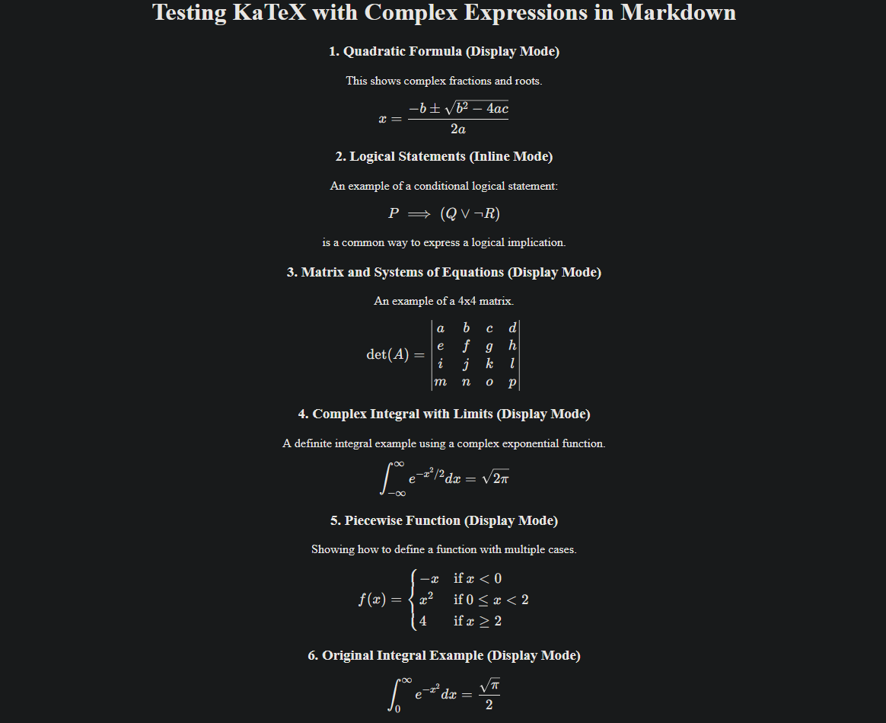

<h1 align="center">
    Math notation in Markdown 
</h1>

    This repository as a part of tutorial offers a method to render math notation through <i>katex</i> in markdown through <i>mdsvex</i> module in <i>svelte</i> apps. Hopefully will be updated after blog post.

    
    

------------------------------------------------------------------------------------------

    
     
    <i>Example math notation render through this template</i>

